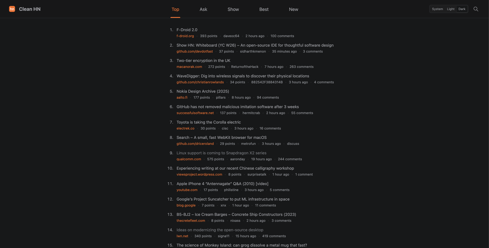
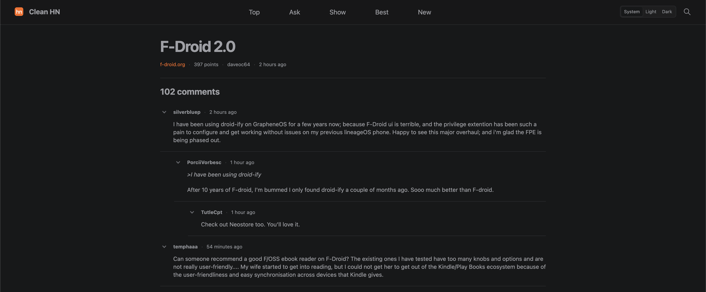

# Clean HN

A small Chrome extension that gives Hacker News list and comment pages a clean reading layout.

## Install locally

1. Open `chrome://extensions`.
2. Enable **Developer mode**.
3. Choose **Load unpacked**.
4. Select this directory.
